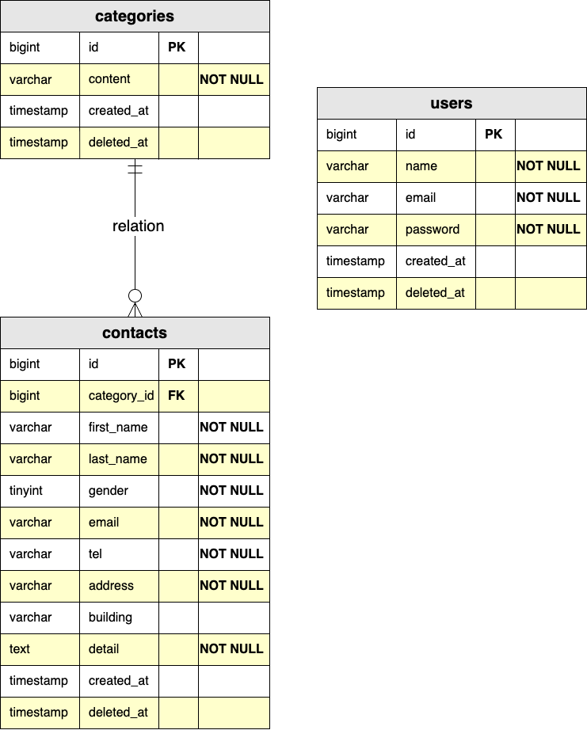

# お問い合わせフォーム

こちらのフォームは、お客様からのお問い合わせをお受けするフォームです。

『お名前・性別・メールアドレス・電話番号・住所・建物名・お問い合わせの種類・お問い合わせ内容』
以上８個の項目を設置しています。

また、管理画面も設置しています。
管理画面にはログイン機能も設置しています。

管理画面では、お問い合わせフォームから受信した顧客データを元に
『条件指定・検索・内容確認・削除』が可能です。
CSVファイルへの抽出も可能です。

環境構築の詳細を以下に記載しております。

尚、Docker環境を使用しております。


## 環境構築

#### リポジトリをクローン

```

git clone git@github.com:ks-kanae/test_contact-form.git

```

#### Laravelのビルド

```
cd test_contact-form

docker-compose up -d --build

```

#### Laravel パッケージのダウンロード

```
docker-compose exec php bash
(PHPコンテナ内へログイン)
```

```
composer install
(PHPコンテナ上で実行)
```

#### .env ファイルの作成

```
cp .env.example .env
(PHPコンテナ上で実行)
```

#### .env ファイルの修正

```
DB_CONNECTION=mysql
- DB_HOST=127.0.0.1
+ DB_HOST=mysql
DB_PORT=3306
- DB_DATABASE=laravel
- DB_USERNAME=root
- DB_PASSWORD=
+ DB_DATABASE=laravel_db
+ DB_USERNAME=laravel_user
+ DB_PASSWORD=laravel_pass
```

#### キー生成

```
php artisan key:generate
(PHPコンテナ上で実行)
```

#### マイグレーション・シーディングを実行

```
php artisan migrate
(PHPコンテナ上で実行)
```
```
php artisan db:seed
(PHPコンテナ上で実行)
```

## 使用技術（実行環境）

フレームワーク：Laravel 8.75

言語：php 8.1.33

Webサーバー：Nginx 1.21.1

データベース：MySQL 8.0.36

## ER図



## URL

アプリケーション：http://localhost/

ユーザー登録：http://localhost/register

phpMyAdmin：http://localhost:8080/
